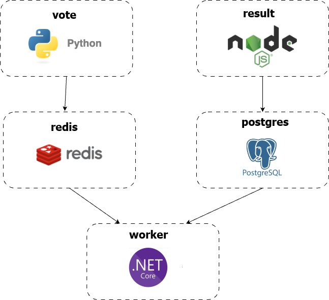

Example Voting App
=========

A simple distributed application running across multiple Docker containers.
This project is a modified version of https://github.com/dockersamples/example-voting-app.

Getting started
---------------

Download [Docker Desktop](https://www.docker.com/products/docker-desktop) for Mac or Windows. [Docker Compose](https://docs.docker.com/compose) will be automatically installed. On Linux, make sure you have the latest version of [Compose](https://docs.docker.com/compose/install/).

Linux Containers
----------------

The Linux stack uses Python, Node.js, and .NET, with Redis for message queueing and Postgres for the database.

To deploy, run:

```shell
docker compose up
```

The app will be running at [http://localhost:5000](http://localhost:5000), and the results will be at [http://localhost:5001](http://localhost:5001).

Architecture
------------



* A frontend web app in [Python](/vote) which lets you vote between two options
* A [Redis](https://hub.docker.com/_/redis/) queue which collects new votes
* A [.NET](/worker) worker which consumes votes from the redis queue and stores them in the database
* A [Postgres](https://hub.docker.com/_/postgres/) database backed by a Docker volume
* A [Node.js](/result) web app which shows the results of the voting in real time